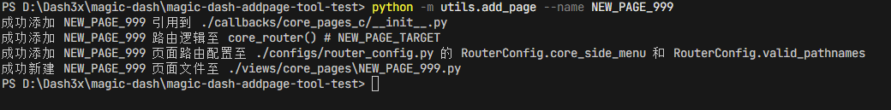

# magic-dash-addpage
add-page plugins for magic-dash

一键为magic-dash添加页面

1. 添加页面引用与渲染逻辑
2. 添加页面路由配置
3. 创建页面默认模板文件


### 使用方法

```cmd
python -m utils.add_page --name NEW_PAGE_NAME
```




          
##### 参数说明

| 参数 | 是否必需 | 默认值 | 描述 |
|------|---------|--------|------|
| `--name` | 是 | 无 | 页面名称 |
| `--title` | 否 | 与 --name 相同 | 页面标题 |
| `--describe` | 否 | 自动生成描述信息 | 页面描述 |
| `--url` | 否 | /core/{page_name} | 页面 URL 路径 |
| `--icon` | 否 | antd-menu | 页面图标 |


```cmd
python utils/add_page.py --name <页面名称> [--title <页面标题>] [--describe <页面描述>] [--url <页面URL>] [--icon <页面图标>]
```